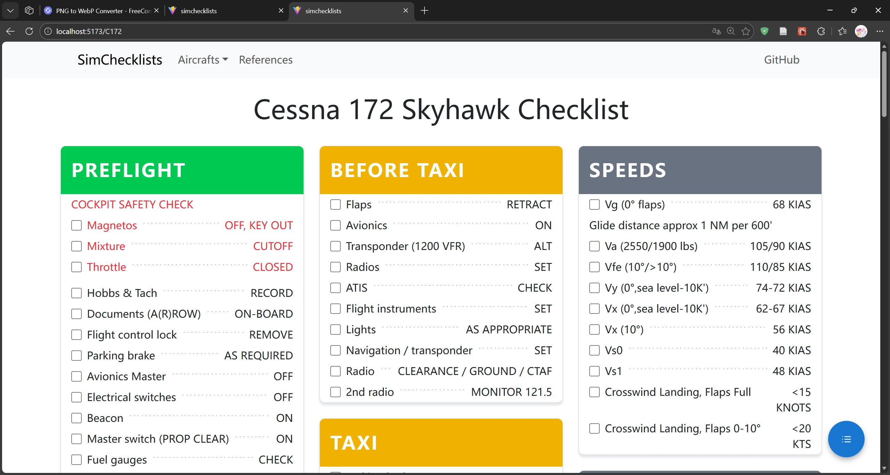

# SimChecklists / 愛乃ちゃん's EFB Project

The elegant & optimized checklist solution for flight simulation. Built with React.

[https://fly.toothlessos.xyz/](-> Official Deployment <-)



## Setup

1. Clone the repository:

   ```bash
   git clone https://github.com/ToothlessOS/SimChecklists.git
   cd SimChecklists/SimChecklists # Where the project.json file is located
   ```

2. Install dependencies:

   ```bash
   npm install
   ```

3. Start the development server:

   ```bash
   npm run dev
   ```

## Contributing

You can easily contribute more checklists to the project with the following steps:

1. Create a new `AircraftNameChecklist.ts` file in the `src/checklists` directory. The file should look like this:

```typescript
import { Checklist } from "../types/checklist";
const C172Checklist: ChecklistData = {
    ...
};
export default C172Checklist;
```

where `ChecklistData` should be structured as follows (You may also refer to `C172Checklist.ts` as an example):

(TIPS: Consider using a LLM to generate the checklist data structure from existing checklist documents!)

```typescript
export type CheckItem = {
  id: string;
  action: string; // Action to perform
  expected: string; // Expected state
  note?: string; // Additional note for the checklist item; Displayed in smaller font under the item
  section?: string;
  highlight?: boolean; // Display the item red
};

export type CheckNote = {
  id: string;
  description: string; // Note description
  section?: string;
  subsection?: string;
  highlight?: boolean; // Display the note in red
};

export type CheckContent = (CheckItem | CheckNote)[]; // Two types of entries are available: Item and Note

export type ChecklistData = Record<
  string,
  { content: CheckContent; color: string }
>; // KEY: Checklist Section Name; VALUE: {content: CheckContent, color: string (tailwind css color class, i.e. bg-green-500)}
```

2. Add your checklist page to React Router in `src/App.tsx`:

```typescript
import AircraftNameChecklist from "./checklists/AircraftNameChecklist";

...

function App() {
  return (
    // Handling frontend routing with React Router
    <Routes>
      <Route path="/" element={<Home />} />
      <Route path="/ref" element={<References />} />
      <Route path="/C172" element={<C172 />} />
      <Route path="/AircraftName" element={<AircraftNameChecklist />} />
      ...
    </Routes>
  );
}
...
```

3. Add the link to you checklist page to `./checklists/available.ts` to render it on the navigation bar:

```typescript
const entriesAvail = {
    C172: "/C172",
    AircraftName: "/AircraftName",
    ...
};
```

4. To uphold academic integrity, please add source of checklist in `./checklists/bib.ts`:

```typescript
const bib = {
    "C172": "https://eastcoastaeroclub.com/wp-content/uploads/2025/08/C172S-Skyhawk-Checklist_04-August-2025.pdf"
    "AircraftName": "SOURCE_URL_HERE",
    ...
}
```

5. Commit and push your changes. Create a pull request to the main repository for review.

6. WORK IN PROGRESS: After approval, your checklist will be merged into the main project and deployed to the [https://fly.toothlessos.xyz/](official site) with CI/CD pipelines!
